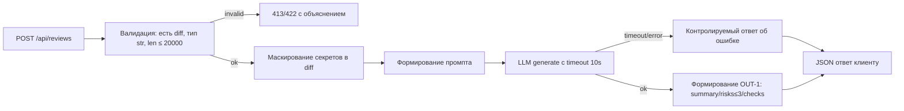
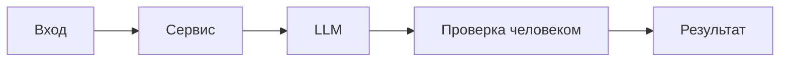

# ADR: решение для первого рабочего сценария

- Статус: proposed
- Дата: 2026-09-10
- Ответственные: команда backend

## Контекст

Есть сервис, принимающий diff и отдающий комментарий, сейчас без валидации входа, маскирования секретов, таймаута/обработки ошибок LLM и без стабильного формата ответа. Требуется привести поведение к правилам Context Pack: SEC-1, API-1, REL-1, OUT-1, QA-1, OBS-1, SCOPE-1.

## Решение

Ввести слой валидации и ограничений на эндпоинте `/api/reviews` (422/413), добавить маскирование секретов перед вызовом LLM, обернуть вызов LLM таймаутом 10 секунд с контролируемым ответом при сбоях, нормализовать результат к контракту OUT-1 (`summary`, `risks` ≤3, `checks`). Не логировать содержимое diff и ответов модели, `OBS-1`: в лог пишутся только `request_id`, длительность и статус.

## Рассмотренные альтернативы

| Альтернатива | Почему не выбрали сейчас |
|---|---|
| Доверять клиенту и не валидировать | Приводит к 500 и непредсказуемости, нарушает API-1 |
| Проксировать ответ LLM как есть | Нет стабильного формата, сложно автоматизировать, нарушает OUT-1 |
| Увеличить таймаут >10с | Ухудшает UX и SLO, нарушает REL-1 |

## Последствия и главный риск

- Положительные последствия:
  - Предсказуемые ответы и ошибки; отсутствие утечек секретов; возможность автопроверок по контракту.
- Ограничения:
  - Возможны краткие/обрезанные ответы LLM из-за малого контекста; длина diff ограничена.
- Главный риск:
  - Ложноположительное или недостаточное маскирование секретов.
- Как проверим риск:
  - Синтетические тесты на паттерны секретов; ручной аудит; мониторинг инцидентов.

## Архитектурная схема

Общая схема решения:

Схема тестирования: 

## Как использовали AI

- Для чего: Для формулировки ADR
- Тип промпта: master prompt
- Строка в [`prompts.md`](prompts.md): p1-03
- Что проверили и исправили сами: Проверена на соответсвие контексту им задачи. Добавлена конкретика по политике логирования и по схеме решения
