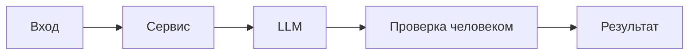

# ADR: решение для первого рабочего сценария

Файл ведёт OpenCode. Обсудите с агентом содержание и проверьте предложенный diff. Все дополнения и исправления поручайте агенту в чате.

- Статус: proposed / accepted
- Дата:
- Ответственные:

## Контекст

## Решение

## Рассмотренные альтернативы

| Альтернатива | Почему не выбрали сейчас |
|---|---|
|  |  |

## Последствия и главный риск

- Положительные последствия:
- Ограничения:
- Главный риск:
- Как проверим риск:

## Архитектурная схема

## Как использовали AI

- Для чего:
- Тип промпта:
- Строка в [`prompts.md`](prompts.md):
- Что проверил студент и какие исправления поручил агенту:
