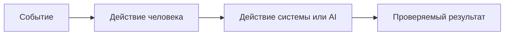

Заполняю файл practices/practice_01/analysis.md: опишу AS IS, добавлю детализированную схему TO BE в mermaid и таблицу различий. Секцию "Как использовали AI" оставлю без изменений.
← Patched mnt/c/Users/x1000/Documents/vscode/ITMOv2/practices/practice_01/analysis.md
# Анализ процесса: AS IS и TO BE

## AS IS
## AS IS

Событие: клиент (разработчик/ревьюер) отправляет POST на `/api/reviews` с JSON‑телом.

Ход процесса сейчас:
- FastAPI эндпоинт `create_review(payload: dict)` извлекает `payload["diff"]` без валидации. При отсутствии ключа — `KeyError` и HTTP 500. Нет проверки типа и длины строки.
- `ReviewService.review(diff)` формирует промпт вида: `"Review this pull request and find problems:\n{diff}"` и отправляет во внешний LLM «как есть», без маскировки секретов и без ограничений по размеру.
- Обработка ошибок и таймаутов внешнего LLM отсутствует: долгие/падающие вызовы ведут к задержкам и/или 5xx.
- Ответ возвращается как `{"comment": <свободный текст>}` — формат нестабилен и непригоден для автоматических проверок (нет `summary/risks/checks`).
- Логирование не нормировано: есть риск записи исходного diff/ответа модели в логи/трейсинг.

Участники: клиент → наш Backend (FastAPI) → внешний LLM → клиент.

Точки задержек и потерь:
- Внешний LLM без таймаута → непредсказуемая длительность запроса.
- Отсутствие валидации → 500 при `KeyError`; большие диффы перегружают сервис/провайдера.
- Нефиксированный формат → ручная интерпретация комментария клиентом, невозможность автоматизации.
- Отсутствие маскировки → риск утечки секретов и prompt‑injection.

Опишите текущий процесс от события до результата. Укажите участников, задержки, ручные операции и точки потери информации.

## TO BE

Один компактный целевой процесс с контролируемыми отказами, валидацией и контрактом OUT‑1.

```mermaid
flowchart TD
    A[Клиент: POST /api/reviews \n body: { diff: str }] --> B{Валидация входа}
    B -- нет ключа/тип не str --> E[422 Unprocessable Entity]
    B -- длина > 20000 --> F[413 Payload Too Large]
    B -- ок --> G[Маскирование секретов (SEC-1)]
    G --> H[Формирование безопасного prompt \n (SCOPE-1, QA-1)]
    H --> I[Вызов внешнего LLM \n timeout 10s (REL-1)]
    I --> J{Ответ LLM}
    J -- ошибка/таймаут --> K[Контролируемая ошибка, без утечки данных]
    J -- ok --> L[Парсинг и проверка контракта OUT-1]
    L --> M[JSON: summary, risks<=3(file,line,evidence,risk), checks]
    subgraph Логирование (OBS-1)
      N[request_id, длительность, статус]
    end
    B -.-> N
    I -.-> N
    L -.-> N
```

## TO BE
## Разница

| Что меняется | AS IS | TO BE | Как проверим изменение |
|---|---|---|---|
| Валидация входа | Нет, `payload["diff"]` → 500 при отсутствии | Обязательное поле `diff: str`; 422 при неверном теле | Контрактные тесты на 422 для нетиповых/пустых тел |
| Лимит размера diff | Отсутствует | Отклонение >20 000 символов с 413 | Синтетический diff >20k → 413; мониторинг доли 413 |
| Маскирование секретов (SEC-1) | Нет | Перед LLM удаляем/редактируем токены/пароли/ключи | Интеграционный тест: в diff подставить token → в prompt [REDACTED] |
| Таймаут и обработка LLM (REL-1) | Нет таймаута, падения/зависания → 5xx | Таймаут 10s, ошибки маппятся в контролируемые ответы | Нагрузочный/функц. тест: задержка провайдера → ответ ≤10s, доля >10s = 0% |
| Контракт ответа (OUT-1) | `{"comment": "..."}` свободный текст | Структура: `summary`, `risks`≤3 с `file/line/evidence/risk`, `checks` | Контрактные тесты на схему, парсинг 100% успешен |
| QA-1 подтверждаемость рисков | Не гарантируется | Каждый risk подкреплён строкой diff/правилом | Тесты: наличие `evidence`, корректные `file/line` |
| Логирование (OBS-1) | Возможна запись содержимого diff/ответа | Только `request_id`, длительность, статус | Ревью/аудит логов; автопроверка на отсутствие diff в логах |
| Границы помощника (SCOPE-1) | Модель может «советовать действия» | Промпт и пост‑обработка исключают approve/merge/действия | Анализ содержимого ответов в тестах на отсутствие инструкций к действиям |
| Ошибки/статусы | 5xx при валидации/LLM | 4xx/контролируемые ответы; ≤1% 5xx | Мониторинг 5xx; сценарии отказов возвращают 4xx/предсказуемые ответы |

Опишите один небольшой процесс после изменения. Используйте BPMN, DFD или IDEF*. Если выбранный формат не рендерится в GitHub, положите рядом исходник и PNG, а здесь добавьте ссылки.



## Разница

| Что меняется | AS IS | TO BE | Как проверим изменение |
|---|---|---|---|
|  |  |  |  |

## Как использовали AI

- Для чего:
- Тип промпта:
- Строка в [`prompts.md`](prompts.md):
- Что проверили и исправили сами:
## Как использовали AI

- Для чего:
- Тип промпта:
- Строка в [`prompts.md`](prompts.md):
- Что проверили и исправили сами:
Готово. Я заполнил practices/practice_01/analysis.md:
- AS IS: описал текущий поток от клиента до ответа, указал участников, где возникают ошибки и задержки, и риски (KeyError/500, отсутствие маскировки, отсутствие лимитов, нестабильный формат ответа).
- TO BE: добавил целевой процесс с валидацией входа, лимитом 20k (413), маскированием секретов (SEC-1), таймаутом LLM 10s (REL-1), контрактом OUT-1 и ограниченным логированием (OBS-1). Схема на Mermaid отражает контроль веток ошибок и логирование.
- Разница: таблица с конкретными изменениями и способами проверки (контрактные тесты, синтетические проверки на 413, интеграционные тесты маскировки, проверка таймаутов, аудит логов, тесты на SCOPE-1 и QA-1).
Секцию “Как использовали AI” не трогал.
