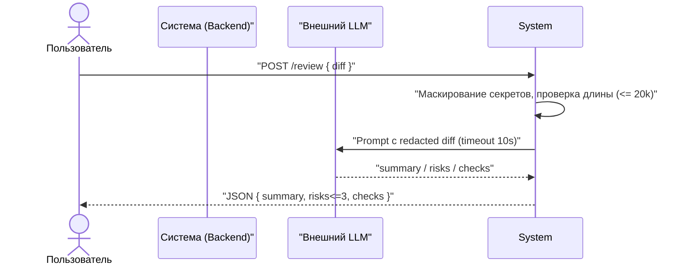
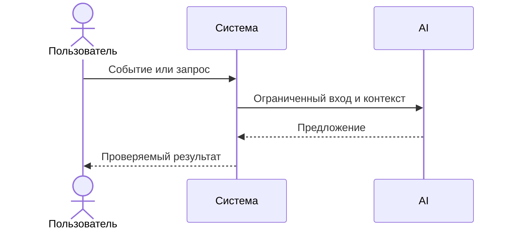

Starting by filling in practices/practice01/product_management.md with use cases and user stories derived strictly from practices/practice01/context.md. I will update the first scenario, the use case table, the sequence diagram, the Gherkin scenarios, and the AI usage section.
← Patched mnt/c/Users/x1000/Documents/vscode/ITMOv2/practices/practice_01/product_management.md
# Use cases и user stories

## Первый рабочий сценарий
## Первый рабочий сценарий

**Когда** разработчик/ревьюер отправляет в API строку diff PR (≤ 20 000 символов), **система** проверяет размер, маскирует секреты, формирует prompt и вызывает внешний LLM с таймаутом 10 секунд, **а пользователь получает** структурированный JSON с полями summary, risks (до 3 элементов с file, line, evidence, risk) и checks.

Не входит в этот сценарий:

- Выполнение действий в GitHub (approve/merge), генерация кода — сервис только советует (SCOPE-1).
- Аутентификация/авторизация на эндпоинте (пока неизвестно).
- Потоковая выдача и выбор языка ответа (RU/EN) — пока неизвестно.
- Логирование содержимого diff и ответа модели (OBS-1).

## Use case

| Поле | Значение |
|---|---|
| Актор | Разработчик/ревьюер (клиент API) |
| Триггер | Отправка POST-запроса с строкой diff PR в сервис |
| Предусловия | Diff предоставлен строкой; длина ≤ 20 000 символов |
| Основной результат | Возвращён JSON с полями summary, risks (≤3, каждый с file, line, evidence, risk) и checks; в логах только request_id, длительность, статус |
| Ошибка или отказ | Diff > 20 000 символов → HTTP 413; таймаут/ошибка внешнего LLM → контролируемый ответ в пределах 10 сек; в текущем AS IS некорректный вход может приводить к 500 (KeyError) |

**Когда** …, **система** …, **а пользователь получает** …


Не входит в этот сценарий:

- 

## Use case

| Поле | Значение |
|---|---|
| Актор |  |
| Триггер |  |
| Предусловия |  |
| Основной результат |  |
| Ошибка или отказ |  |



## User stories и acceptance criteria

```gherkin
Feature:
```gherkin
Feature: Ревью PR по строке diff

  Scenario: Позитивный
    Given валидная строка diff PR длиной не более 20000 символов
    And diff может содержать потенциальные риски
    When клиент отправляет POST запрос к API сервиса с этой строкой diff
    Then сервис маскирует секреты перед отправкой во внешний LLM
    And вызывает внешний LLM с таймаутом 10 секунд
    And возвращает JSON с полями summary, risks (до 3 элементов с file, line, evidence, risk) и checks
    And в логах фиксируются только request_id, длительность и статус

  Scenario: Негативный или граничный
    Given строка diff длиннее 20000 символов
    When клиент отправляет POST запрос к API
    Then сервис не вызывает внешний LLM
    And возвращает HTTP 413
```

  Scenario: Позитивный
    Given
    When
    Then

  Scenario: Негативный или граничный
    Given
    When
    Then
```

## Как использовали AI

- Для чего:
- Тип промпта:
- Строка в [`prompts.md`](prompts.md):
- Что проверили и исправили сами:
## Как использовали AI

- Для чего: Формализация первого рабочего сценария, use case и acceptance критериев на основе контекста и правил (Context Pack)
- Тип промпта: zero-shot
- Строка в [`prompts.md`](prompts.md): #TODO
- Что проверили и исправили сами: Сверили с practices/practice_01/context.md и правилами OUT-1, SEC-1, API-1, REL-1, SCOPE-1, QA-1, OBS-1
Я заполнил practices/practice01/product_management.md строго по practices/practice01/context.md.
Сделано:
- Первый рабочий сценарий: описал событие, действия системы (валидация длины, маскирование секретов, вызов внешнего LLM с таймаутом), и результат (структурированный JSON с summary, risks≤3, checks).
- Явно выделил, что не входит в сценарий: действия в GitHub, аутентификация/авторизация, язык/стриминг ответов, логирование содержимого.
- Use case: заполнил актор, триггер, предусловия, основной результат, ошибки/отказы. Указал 413 для слишком длинного diff и контролируемый ответ при таймауте/ошибке LLM; отметил текущую проблема AS IS с 500 на KeyError без домыслов.
- Диаграмма последовательностей: отразил POST {diff}, маскирование и проверку длины, вызов LLM с таймаутом, возвращение JSON.
- User stories (Gherkin): позитивный сценарий и граничный случай с 413. Acceptance критерии соответствуют правилам OUT-1, SEC-1, API-1, REL-1, OBS-1.
- Как использовали AI: описал факт использования и проверку по Context Pack, оставил ссылку #TODO для строки в prompts.md как в контексте.
Если нужно дополнить неизвестные пункты (аутентификация/авторизация, точный формат ответа, язык/потоковость) — в контексте нет данных, поэтому я их отметил как неизвестные и не заполнял.