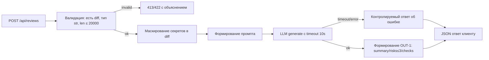
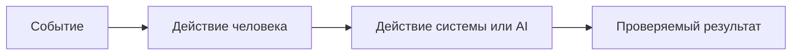

# Анализ процесса: AS IS и TO BE

Файл ведёт OpenCode. Обсудите с агентом содержание и проверьте предложенный diff. Все дополнения и исправления поручайте агенту в чате.

## AS IS

Событие: клиент отправляет HTTP POST на эндпоинт `/api/reviews` с JSON-полем `diff`.

Участники и шаги:
- Клиент API.
- Наш Backend (FastAPI): `app/api.py` добавляет POST-обработчик, который без валидации берёт `payload["diff"]` и вызывает `review_service.review(...)` (TRAINING_PR.diff: L35-38).
- Сервис: `ReviewService.review` формирует промпт строкой `"Review this pull request and find problems:\n{diff}"` и вызывает внешний `llm.generate(prompt)` (TRAINING_PR.diff: L19-22).
- Внешний LLM-провайдер.

Задержки и ошибки:
- Нет лимита длины входа: возможно отправить очень большой diff (нарушает API-1), что ведёт к лишним затратам и задержкам.
- Нет маскирования секретов перед отправкой diff во внешний LLM (нарушает SEC-1).
- Нет обработки исключений/таймаута LLM (нарушает REL-1): ошибка или зависание пробрасываются наверх, формат ответа непредсказуем.
- Нет стабильного формата ответа OUT-1: сейчас возвращается `{\"comment\": answer}` (TRAINING_PR.diff: L21-22), что не соответствует требуемым `summary/risks/checks`.
- Нет валидации входа: при отсутствии ключа `diff` возникает `KeyError` и 500 (TRAINING_PR.diff: L36-37 по коду обращения к ключу).

## TO BE

Процесс с контролем входа, безопасной обработкой и стабильным контрактом результата:

## Разница

| Что меняется | AS IS | TO BE | Как проверим изменение |
|---|---|---|---|
| Валидация входа | Нет, возможен KeyError | 422 при отсутствии `diff`, 413 при длине > 20000 | Интеграционный тест: POST без `diff`; POST с 20001 символом |
| Маскирование секретов | Нет | Секреты заменяются на `[REDACTED]` перед вызовом LLM | Юнит-тест на функции маскирования; интеграционный с синтетическим token |
| Таймаут и обработка LLM | Нет | Таймаут 10с и маппинг в контролируемый ответ | Интеграционный тест с mock LLM, имитирующим зависание/исключение |
| Формат ответа | `{\"comment\": answer}` | `summary`, `risks` (≤3, с file/line/evidence/risk), `checks` | Контрактный тест на схему ответа |
| Логи | Не определено | Логируются только `request_id`, длительность, статус | Просмотр логов в тестовом окружении, отсутствие diff/ответа |

## Как использовали AI

- Для чего: Анализа текущего состояния и того состояния проекта, которое должно быть
- Тип промпта: Master prompt
- Строка в [`prompts.md`](prompts.md): p1-03
- Что проверили и исправили сами: Проверил корректность AS IS и соотвествие TO BE требованиям
