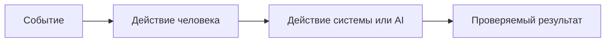

# Анализ процесса: AS IS и TO BE

Файл ведёт OpenCode. Обсудите с агентом содержание и проверьте предложенный diff. Все дополнения и исправления поручайте агенту в чате.

## AS IS

Расскажите OpenCode о текущем процессе. Попросите агента описать участников, задержки, ручные операции и точки потери информации.

## TO BE

Обсудите с OpenCode один процесс после изменения. Поручите агенту описать его в BPMN, DFD или IDEF*. Если GitHub не отображает выбранный формат, агент сохраняет рядом исходник и PNG и добавляет ссылки.

## Разница

| Что меняется | AS IS | TO BE | Как проверим изменение |
|---|---|---|---|
|  |  |  |  |

## Как использовали AI

- Для чего:
- Тип промпта:
- Строка в [`prompts.md`](prompts.md):
- Что проверил студент и какие исправления поручил агенту:
