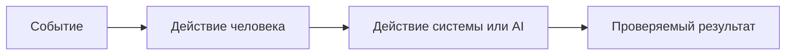

# Анализ процесса: AS IS и TO BE

## AS IS

Опишите текущий процесс от события до результата. Укажите участников, задержки, ручные операции и точки потери информации.

## TO BE

Опишите один небольшой процесс после изменения. Используйте BPMN, DFD или IDEF*. Если выбранный формат не рендерится в GitHub, положите рядом исходник и PNG, а здесь добавьте ссылки.

## Разница

| Что меняется | AS IS | TO BE | Как проверим изменение |
|---|---|---|---|
|  |  |  |  |

## Как использовали AI

- Для чего:
- Тип промпта:
- Строка в [`prompts.md`](prompts.md):
- Что проверили и исправили сами:
