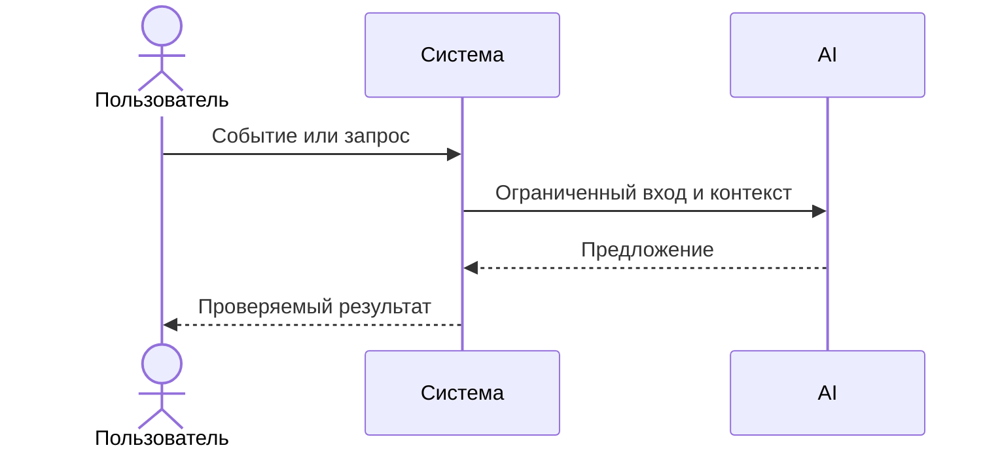

# Use cases и user stories

## Первый рабочий сценарий

**Когда** клиент отправляет POST `/api/reviews` с корректным `diff` длиной ≤ 20000 символов, **система** валидирует вход, маскирует секреты, формирует промпт и вызывает внешний LLM с таймаутом 10 секунд, **а пользователь получает** структурированный JSON: `summary`, `risks` (до 3 с полями file, line, evidence, risk) и `checks`.

Не входит в этот сценарий:

- approve/merge PR, любые действия в GitHub; изменение клиентских систем; правила snake_case БД и i18n фронтенда.

## Use case

| Поле | Значение |
|---|---|
| Актор | Клиент API (разработчик/ревьюер) |
| Триггер | Запрос POST `/api/reviews` с JSON телом `{"diff": "..."}` |
| Предусловия | Сервис доступен; длина diff ≤ 20000 символов; формат JSON валиден |
| Основной результат | Ответ JSON с `summary`, `risks` ≤3, `checks` (OUT-1) |
| Ошибка или отказ | 422 при отсутствии/неверном типе `diff`; 413 при длине > 20000; контролируемая ошибка при таймауте/сбое LLM (REL-1) |



## User stories и acceptance criteria

```gherkin
Feature: Review PR diff via API

  Scenario: Позитивный ответ по контракту OUT-1
    Given сервис запущен
    And у меня есть корректный diff длиной 1000 символов
    When я отправляю POST /api/reviews с JSON телом {"diff": "..."}
    Then я получаю 200 OK
    And тело ответа содержит поля summary, risks, checks
    And в risks не больше 3 элементов и каждый содержит file, line, evidence, risk

  Scenario: Отсутствует поле diff
    Given сервис запущен
    When я отправляю POST /api/reviews с пустым JSON {}
    Then я получаю 422 Unprocessable Entity

  Scenario: Слишком длинный diff
    Given сервис запущен
    And у меня есть diff длиной 20001 символ
    When я отправляю POST /api/reviews с этим diff
    Then я получаю 413 Payload Too Large

  Scenario: Таймаут внешнего LLM
    Given mock LLM зависает дольше 10 секунд
    When я отправляю корректный запрос
    Then я получаю контролируемый ответ об ошибке без 5xx и в пределах 10 секунд
```

## Как использовали AI

- Для чего: Формулирования контекста о проекте
- Тип промпта: masteprompt
- Строка в [`prompts.md`](prompts.md): p1-03
- Что проверили и исправили сами: Проверено на соответствие действилеьности
