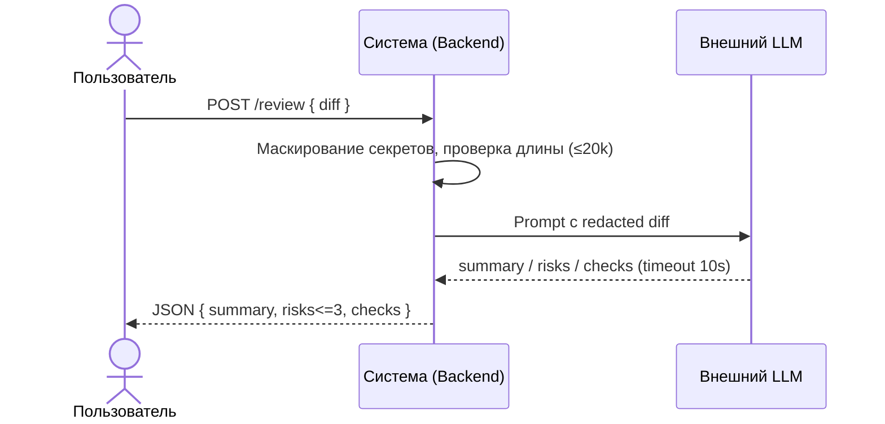

# Use cases и user stories

## Первый рабочий сценарий

**Когда** разработчик/ревьюер отправляет в API строку diff PR (≤ 20 000 символов), **система** проверяет размер, маскирует секреты, формирует prompt и вызывает внешний LLM с таймаутом 10 секунд, **а пользователь получает** структурированный JSON с полями summary, risks (до 3 элементов с file, line, evidence, risk) и checks.

Не входит в этот сценарий:

- Выполнение действий в GitHub (approve/merge), генерация кода — сервис только советует (SCOPE-1).
- Аутентификация/авторизация на эндпоинте.
- Потоковая выдача и выбор языка ответа (RU/EN)
- Логирование содержимого diff и ответа модели (OBS-1).

## Use case

| Поле | Значение |
|---|---|
| Актор | Разработчик/ревьюер (клиент API) |
| Триггер | Отправка POST-запроса с строкой diff PR в сервис |
| Предусловия | Diff предоставлен строкой; длина ≤ 20 000 символов |
| Основной результат | Возвращён JSON с полями summary, risks (≤3, каждый с file, line, evidence, risk) и checks; в логах только request_id, длительность, статус |
| Ошибка или отказ | Diff > 20 000 символов → HTTP 413; таймаут/ошибка внешнего LLM → контролируемый ответ в пределах 10 сек |



## User stories и acceptance criteria

```gherkin
Feature: Ревью PR по строке diff

  Scenario: Позитивный
    Given валидная строка diff PR длиной не более 20000 символов
    And diff может содержать потенциальные риски
    When клиент отправляет POST запрос к API сервиса с этой строкой diff
    Then сервис маскирует секреты перед отправкой во внешний LLM
    And вызывает внешний LLM с таймаутом 10 секунд
    And возвращает JSON с полями summary, risks (до 3 элементов с file, line, evidence, risk) и checks
    And в логах фиксируются только request_id, длительность и статус

  Scenario: Негативный или граничный
    Given строка diff длиннее 20000 символов
    When клиент отправляет POST запрос к API
    Then сервис не вызывает внешний LLM
    And возвращает HTTP 413
```

## Как использовали AI

- Для чего: Формулировка контрактов между пользователем и сервисом, описание Use case и user stories
- Тип промпта: RCTF + few-shots
- Строка в [`prompts.md`](prompts.md): [p-01-02-03](./prompts.md:10)
- Что проверили и исправили сами: Проверка на галюценации и включение информации о AS IS. Исправлены AS IS и ошибки парсинга `mermaid`
