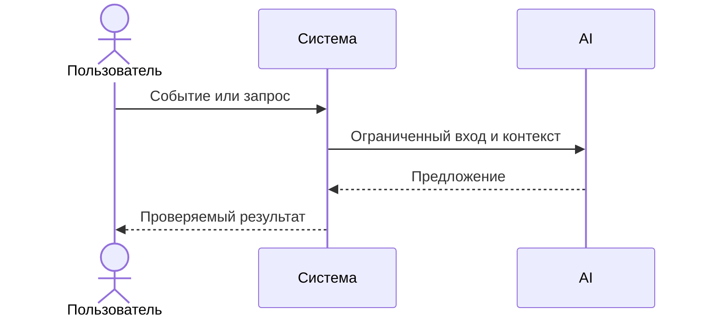

# Use cases и user stories

Файл ведёт OpenCode. Обсудите с агентом содержание и проверьте предложенный diff. Все дополнения и исправления поручайте агенту в чате.

## Первый рабочий сценарий

**Когда** …, **система** …, **а пользователь получает** …

Не входит в этот сценарий:

- 

## Use case

| Поле | Значение |
|---|---|
| Актор |  |
| Триггер |  |
| Предусловия |  |
| Основной результат |  |
| Ошибка или отказ |  |



## User stories и acceptance criteria

```gherkin
Feature:

  Scenario: Позитивный
    Given
    When
    Then

  Scenario: Негативный или граничный
    Given
    When
    Then
```

## Как использовали AI

- Для чего:
- Тип промпта:
- Строка в [`prompts.md`](prompts.md):
- Что проверил студент и какие исправления поручил агенту:
