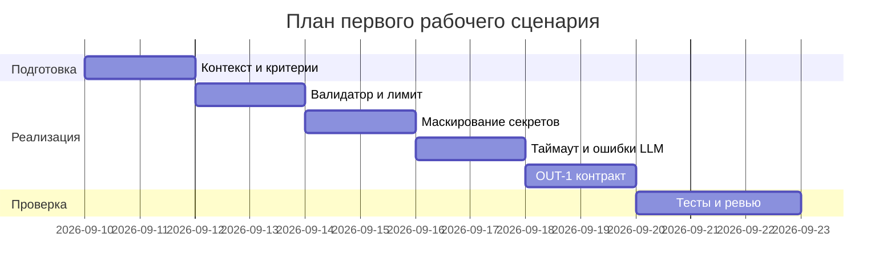

# План поставки

## Инкременты и ответственность

| Инкремент | Наблюдаемый результат | Что делает человек | Что делает AI или субагент | Проверка | Зависимости |
|---|---|---|---|---|---|
| 1 | Валидация входа и лимит длины | Определяет схему входа, реализует проверки | Генерирует тест-кейсы и схему | Интеграционный тест 422/413 | Context Pack API-1 |
| 2 | Маскирование секретов | Реализует фильтр/маску | Предлагает паттерны и тесты | Юнит-тест на маскирование | SEC-1 |
| 3 | Таймаут и обработка ошибок LLM | Настраивает таймаут, маппит ошибки | Предлагает шаблон обработки | Интеграционные тесты с mock | REL-1 |
| 4 | Формат OUT-1 | Описывает контракт, реализует маппинг | Генерирует JSON-схему | Контрактные тесты | OUT-1, QA-1 |

## Диаграмма Ганта

## Как использовали AI

- Для чего: Определении расределния задач по времени и определение зависимости 
- Тип промпта: master prompt 
- Строка в [`prompts.md`](prompts.md): p1-03
- Что проверили и исправили сами: Проверены корректность зависимостей фичей 
