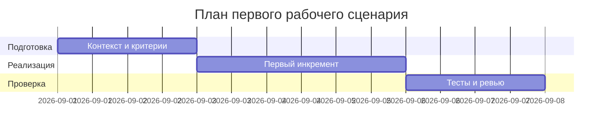

# План поставки

Файл ведёт OpenCode. Обсудите с агентом содержание и проверьте предложенный diff. Все дополнения и исправления поручайте агенту в чате.

## Инкременты и ответственность

| Инкремент | Наблюдаемый результат | Что делает человек | Что делает AI или субагент | Проверка | Зависимости |
|---|---|---|---|---|---|
| 1 |  |  |  |  |  |
| 2 |  |  |  |  |  |
| 3 |  |  |  |  |  |

## Диаграмма Ганта

Передайте OpenCode даты и задачи своего плана и попросите обновить диаграмму.

## Как использовали AI

- Для чего:
- Тип промпта:
- Строка в [`prompts.md`](prompts.md):
- Что проверил студент и какие исправления поручил агенту:
